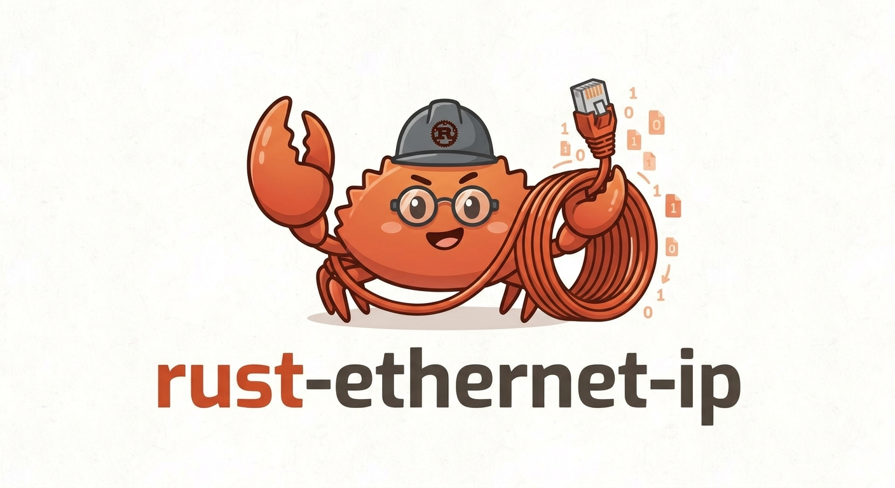
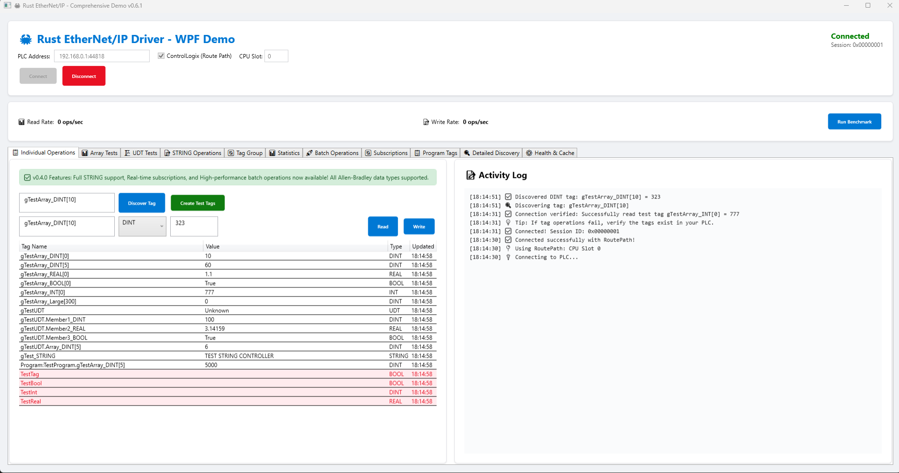
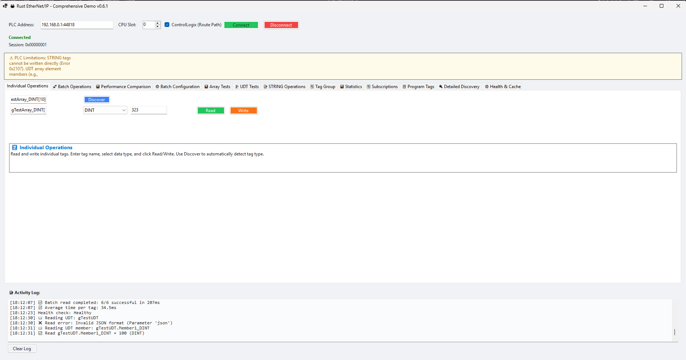
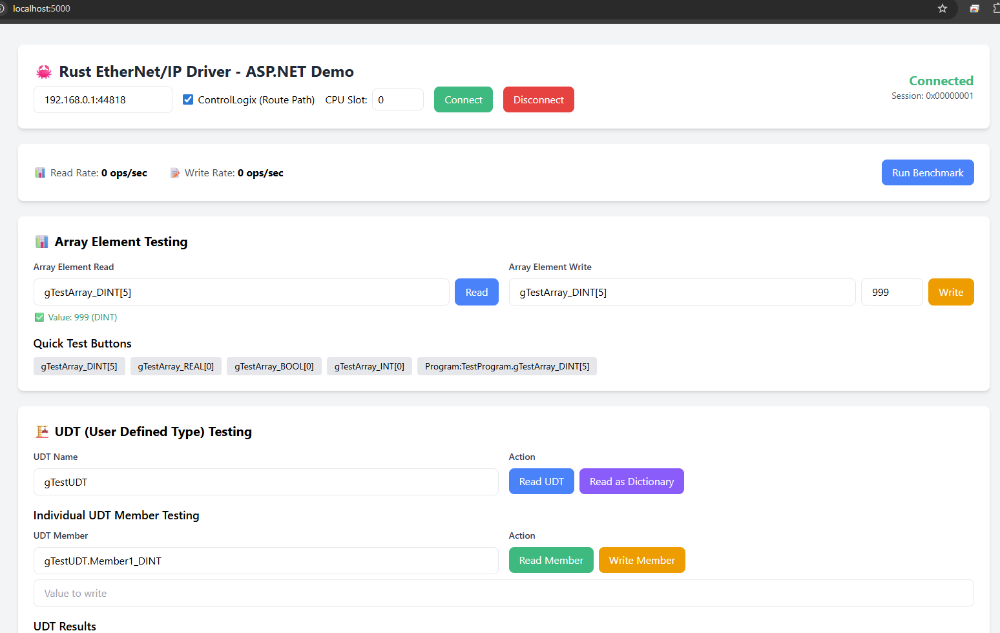

<p align="center">
  
</p>

[](https://www.rust-lang.org)
[](https://github.com/sergiogallegos/rust-ethernet-ip/releases)
[](LICENSE)
[]()
[]()
[]()
[](https://crates.io/crates/rust-ethernet-ip)
[](https://docs.rs/rust-ethernet-ip)
[](https://crates.io/crates/rust-ethernet-ip)
[](https://github.com/sponsors/sergiogallegos)

A high-performance, production-ready EtherNet/IP communication library specifically designed for **Allen-Bradley CompactLogix and ControlLogix PLCs**. Built in pure Rust with focus on **PC applications**, offering exceptional performance, memory safety, and comprehensive industrial features.
 
 **📦 Available on [crates.io](https://crates.io/crates/rust-ethernet-ip)**

## 🎯 **Current Development Focus**

**We are focused on the .NET stack (C# wrappers and examples) for production-quality industrial automation applications.**
 
**🚧 Next release line in progress: `0.7.0` (unreleased). Current published version remains `0.6.3`.**

- 🎯 **Active Development**: 
  - C# wrapper library (`RustEtherNetIp.dll`)
  - WinForms example application
  - WPF example application  
  - ASP.NET example application
  - Advanced features: TagGroup, Statistics, Batch Operations, STRING support, UDT arrays
  - Rust native examples and library improvements

This focused approach ensures we deliver a robust, well-tested, production-ready .NET integration for industrial automation systems.

## 🎯 **Project Focus**

This library is specifically designed for:
- **Allen-Bradley CompactLogix** (L1x, L2x, L3x, L4x, L5x series)
- **Allen-Bradley ControlLogix** (L6x, L7x, L8x series)
- **PC Applications** (Windows, Linux, macOS)
- **Industrial Automation** software
- **High-performance** data acquisition and control

### ✅ **v0.6.3 — Bug Fixes & Reliability** (Latest)
- **Critical protocol fixes**: Added 6 missing CIP type handlers (LINT, USINT, UINT, UDINT, ULINT, LREAL), fixed CIP response bounds check, fixed UDT STRING 4-byte DINT length parsing
- **Packet correctness**: Rewrote `negotiate_packet_size`, fixed keep-alive NOP, fixed `unregister_session` packet format
- **C# wrapper**: Fixed `WriteTag` for 7 missing types, removed phantom UDT keys, fixed keep-alive route preservation, cleaned up debug output
- **Subscription improvements**: Change detection now works for all data types (was REAL-only)
- **PLC Simulator**: New `plc_sim` binary and in-process test simulator for testing without hardware
- **Tag introspection**: `get_tag_attributes` for discovering tag type, size, and scope
- **Subscriptions API**: Real-time tag monitoring with `subscribe_tag` / `unsubscribe_tag`
- **Bit-level API**: Read/write individual bits within DINT tags

### ✅ **v0.6.2 New Features**
- **🔌 Stream Injection API**: New `connect_with_stream()` for custom TCP transport
  - Wrap streams for metrics/observability (bytes in/out)
  - Apply custom socket options (keepalive, timeouts, bind local address)
  - Reuse pre-established tunnels/connections
  - Use in-memory streams for deterministic testing
- **🧪 Test Configuration**: Environment variable support for PLC testing
  - `TEST_PLC_ADDRESS` - Set PLC IP address for tests
  - `TEST_PLC_SLOT` - Set CPU slot number
  - `SKIP_PLC_TESTS` - Skip PLC-dependent tests
- **🧪 PLC Simulator**: Run tests without a physical PLC
  - `cargo run --bin plc_sim` to start the simulator
  - Rust integration tests use the in-process simulator in `tests/plc_sim_tests.rs`
  - C# tests can target the simulator by setting `SIM_PLC_ADDRESS`
- **🐛 Fixed Nested UDT Access**: Fixed reading nested UDT members from array elements
  - Correctly handles `Cell_NestData[90].PartData.Member` paths
  - Now returns specific member values instead of entire UDT


## ✨ **Key Features**

### 🔍 **Key Capabilities**
- **UDT Discovery**: Automatic UDT structure detection from PLC
- **Route Path Support**: ControlLogix slot routing (0-31) and multi-hop network routing
- **Packet Optimization**: Dynamic packet size negotiation for optimal performance
- **Batch Operations**: 3-10x faster multi-tag operations
- **Real-Time Subscriptions**: Event-driven tag monitoring with configurable intervals
- **Connection Management**: Automatic session handling, health monitoring, and error recovery

### ⚠️ **Known Limitations**

The following operations are **not supported** due to PLC firmware restrictions. These limitations are inherent to the Allen-Bradley PLC firmware and cannot be bypassed at the library level.

#### STRING Tag Writing

**Cannot write directly to STRING tags** (e.g., `gTest_STRING`, `Program:TestProgram.gTest_STRING`).

**Root Cause:** PLC firmware limitation (CIP Error 0x2107). The PLC rejects direct write operations to STRING tags, regardless of the communication method used.

**What Works:**
- ✅ Reading STRING tags: `gTest_STRING` (read successfully)
- ✅ Reading STRING members in UDTs: `gTestUDT.Member5_String` (read successfully)

**What Doesn't Work:**
- ❌ Writing simple STRING tags: `gTest_STRING` (write fails - PLC limitation)
- ❌ Writing program-scoped STRING tags: `Program:TestProgram.gTest_STRING` (write fails - PLC limitation)
- ❌ Writing STRING members in UDTs directly: `gTestUDT.Member5_String` (write fails - must write entire UDT)

**Workaround for STRING Members in UDTs:**
If the STRING is part of a UDT structure, you can write it by reading the entire UDT, modifying the STRING member in memory, then writing the entire UDT back:

```rust
// Read entire UDT
let mut udt = client.read_tag("gTestUDT").await?;

// Modify STRING member in memory (if UDT structure is known)
// ... modify UDT structure ...

// Write entire UDT back
client.write_tag("gTestUDT", udt).await?;
```

**Note:** For standalone STRING tags (not part of a UDT), there is no workaround at the communication library level. Alternative approaches may include using PLC ladder logic or other PLC-side mechanisms to update STRING values.

#### UDT Array Element Member Writing

**Cannot write directly to members of UDT array elements** (e.g., `gTestUDT_Array[0].Member1_DINT`).

**Root Cause:** PLC firmware limitation (CIP Error 0x2107). The PLC does not support direct write operations to individual members within UDT array elements.

**What Works:**
- ✅ Reading UDT array element members: `gTestUDT_Array[0].Member1_DINT` (read successfully)
- ✅ Writing entire UDT array elements: `gTestUDT_Array[0]` (write full UDT structure)
- ✅ Writing UDT members (non-array): `gTestUDT.Member1_DINT` (write individual members of non-array UDTs)
- ✅ Writing simple array elements: `gArray[5]` (write elements of simple arrays like DINT[], REAL[], etc.)

**What Doesn't Work:**
- ❌ Writing UDT array element members: `gTestUDT_Array[0].Member1_DINT` (write fails - PLC limitation)
- ❌ Writing program-scoped UDT array element members: `Program:TestProgram.gTestUDT_Array[0].Member1_DINT` (write fails - PLC limitation)

**Workaround:**
Use a read-modify-write pattern:

```rust
// Read entire UDT array element
let mut element = client.read_tag("gTestUDT_Array[0]").await?;

// Modify member in memory (if UDT structure is known)
// ... modify UDT structure ...

// Write entire UDT array element back
client.write_tag("gTestUDT_Array[0]", element).await?;
```

#### Summary of Limitations

**Test Results (392 tags tested):**
- ✅ **333/392 tags** (84.9%) successfully read and written
- ❌ **59/392 tags** failed due to PLC firmware limitations:
  - 55 tags: UDT array element member writes (e.g., `gTestUDT_Array[0].Member1_DINT`)
  - 2 tags: Simple STRING tag writes (e.g., `gTest_STRING`)
  - 2 tags: STRING member writes in UDTs (e.g., `gTestUDT.Member5_String`)

**Important Notes:**
- These limitations are **PLC firmware restrictions**, not library bugs
- The library correctly implements the EtherNet/IP and CIP protocols
- All read operations work correctly for all tag types
- Workarounds are available for UDT array element members and STRING members in UDTs
- Standalone STRING tag writes have no workaround at the communication library level

**📚 For detailed technical information about these limitations, including official Rockwell documentation references and technical background, see [AB_String_UDT_Write_Limitations.md](docs/AB_String_UDT_Write_Limitations.md).**

### 📍 **Advanced Tag Addressing**
- **Program-scoped tags**: `Program:MainProgram.Tag1`
- **Array elements**: `MyArray[5]`, `MyArray[1,2,3]` (read/write supported)
- **Bit access**: `MyDINT.15`
- **UDT members**: `MyUDT.Member1.SubMember`
- **Nested UDT arrays**: `Cell_NestData[90].PartData.Member` ✅ **v0.6.2**
- **String operations**: `MyString.LEN`, `MyString.DATA[5]`
- **Complex paths**: `Program:Production.Lines[2].Stations[5].Motor.Status.15`

### 📊 **Data Types**
All 13 Allen-Bradley native types: BOOL, SINT, INT, DINT, LINT, USINT, UINT, UDINT, ULINT, REAL, LREAL, STRING, UDT

### 🔗 **C# Integration** 🎯 **Production Ready**
- Complete C# wrapper with all data types
- Production-ready examples: WinForms, WPF, ASP.NET
- Advanced features: TagGroup, Statistics, Batch Operations
- Cross-platform support (Windows, Linux, macOS)

## 🚀 **Performance Characteristics**

Optimized for PC applications with excellent performance:

> **🆕 Latest Reliability and Performance Notes (v0.6.3 stable line)**
> 
> Recent optimizations and improvements:
> - **v0.6.3 reliability fixes**: Protocol correctness, packet/session fixes, and broader test hardening
> - **Generic UDT Format**: New `UdtData` struct enables universal UDT handling
> - **Memory allocation improvements**: 20-30% reduction in allocation overhead for network operations
> - **Batch operations**: 3-10x faster than individual operations
> - **Code quality**: Enhanced with idiomatic Rust patterns and clippy optimizations
> - **Network efficiency**: Optimized packet building with pre-allocated buffers
> - **Library Health**: 230+ automated tests discovered across workspace targets, production-ready core

| Operation | Throughput | Latency | Memory Usage |
|-----------|------------|---------|--------------|
| Single Tag Read | 3,000+ ops/sec | <1ms | ~800B |
| Single Tag Write | 1,500+ ops/sec | <2ms | ~800B |
| Batch Operations | 2,000+ ops/sec | 5-20ms | ~2KB |
| Real-time Subscriptions | 1,000+ tags/sec | 1-10ms | ~1KB |
| Tag Path Parsing | 10,000+ ops/sec | <0.1ms | ~1KB |
| Connection Setup | N/A | 50-200ms | ~4KB |
| Memory per Connection | N/A | N/A | ~4KB base |

## 📋 **Status**

✅ **Production Ready** - All core features implemented and tested
- ✅ Complete data type support (13 Allen-Bradley types)
- ✅ Advanced tag addressing (program-scoped, arrays, UDTs, nested paths)
- ✅ Batch operations (3-10x performance improvement)
- ✅ Real-time subscriptions
- ✅ C# wrapper with WinForms, WPF, and ASP.NET examples
- ✅ Route path support for ControlLogix (slots 0-31)
- ✅ 230+ automated tests discovered across workspace targets

**Note:** ControlLogix systems with CPUs in different slots can use the `RoutePath` API:
```rust
let route = RoutePath::new().add_slot(slot_number);
let mut client = EipClient::with_route_path("192.168.1.100:44818", route).await?;
```

## 🛠️ **Installation**

### 📦 **Rust Library (Crates.io)**

The easiest way to get started is by adding the crate to your `Cargo.toml`:

```toml
[dependencies]
rust-ethernet-ip = "0.6.3"
tokio = { version = "1.0", features = ["full"] }
```

### C# Wrapper
Install via NuGet:

```xml
<PackageReference Include="RustEtherNetIp" Version="0.6.3" />
```

Or via Package Manager Console:
```powershell
Install-Package RustEtherNetIp
```

## 📖 **Quick Start**

### UDT Discovery (v0.5.4)
```rust
use rust_ethernet_ip::{EipClient, RoutePath};

#[tokio::main]
async fn main() -> Result<(), Box<dyn std::error::Error>> {
    // Connect to PLC
    let mut client = EipClient::connect("192.168.0.1:44818").await?;
    
    // Discover UDT structure automatically
    let definition = client.get_udt_definition("Part_Data").await?;
    println!("UDT: {}", definition.name);
    
    for member in &definition.members {
        println!("  {}: {} (offset: {}, size: {} bytes)", 
            member.name, 
            get_data_type_name(member.data_type),
            member.offset, 
            member.size
        );
    }
    
    // Read UDT data using discovered structure
    let udt_data = client.read_udt_chunked("Part_Data").await?;
    
    // Read individual members using discovered offsets
    for member in &definition.members {
        let value = client.read_udt_member_by_offset(
            "Part_Data",
            member.offset as usize,
            member.size as usize,
            member.data_type
        ).await?;
        
        println!("{}: {:?}", member.name, value);
    }
    
    Ok(())
}
```

### Route Path Support (v0.5.4)
```rust
// Create route path for slot 2
let route = RoutePath::new()
    .add_slot(0)  // Backplane slot 0
    .add_slot(2); // Target slot 2

// Connect with route path
let mut client = EipClient::with_route_path("192.168.0.1:44818", route).await?;

// Read tags through the route
let value = client.read_tag("TestTag").await?;
```

### Stream Injection (v0.6.2) - Custom TCP Transport
```rust
use rust_ethernet_ip::EipClient;
use std::net::SocketAddr;
use tokio::net::TcpStream;

#[tokio::main]
async fn main() -> Result<(), Box<dyn std::error::Error>> {
    // Create a custom stream with socket options
    let addr: SocketAddr = "192.168.1.100:44818".parse()?;
    let stream = TcpStream::connect(addr).await?;
    stream.set_nodelay(true)?;
    stream.set_keepalive(true)?;
    
    // Connect using the custom stream
    let route = RoutePath::new().add_slot(0);
    let mut client = EipClient::connect_with_stream(stream, Some(route)).await?;
    
    // Use client normally
    let value = client.read_tag("TestTag").await?;
    
    Ok(())
}
```

**Benefits:**
- Wrap streams for metrics/observability (bytes in/out)
- Apply custom socket options (keepalive, timeouts, bind local address)
- Reuse pre-established tunnels/connections
- Use in-memory streams for deterministic testing

### Basic Usage

```rust
use rust_ethernet_ip::{EipClient, PlcValue};

#[tokio::main]
async fn main() -> Result<(), Box<dyn std::error::Error>> {
    // Connect to CompactLogix PLC
    let mut client = EipClient::connect("192.168.1.100:44818").await?;
    
    // Read different data types
    let motor_running = client.read_tag("Program:Main.MotorRunning").await?;
    let production_count = client.read_tag("Program:Main.ProductionCount").await?;
    let temperature = client.read_tag("Program:Main.Temperature").await?;
    
    // Write values
    client.write_tag("Program:Main.SetPoint", PlcValue::Dint(1500)).await?;
    client.write_tag("Program:Main.StartButton", PlcValue::Bool(true)).await?;
    
    println!("Motor running: {:?}", motor_running);
    println!("Production count: {:?}", production_count);
    println!("Temperature: {:?}", temperature);
    
    Ok(())
}
```

### C# Usage

```csharp
using RustEtherNetIp;

using var client = new EtherNetIpClient();
if (client.Connect("192.168.1.100:44818"))
{
    // Read different data types
    bool motorRunning = client.ReadBool("Program:Main.MotorRunning");
    int productionCount = client.ReadDint("Program:Main.ProductionCount");
    float temperature = client.ReadReal("Program:Main.Temperature");
    
    // Write values
    client.WriteDint("Program:Main.SetPoint", 1500);
    client.WriteBool("Program:Main.StartButton", true);
    
    Console.WriteLine($"Motor running: {motorRunning}");
    Console.WriteLine($"Production count: {productionCount}");
    Console.WriteLine($"Temperature: {temperature:F1}°C");
}
```


### Advanced Tag Addressing

```rust
// Program-scoped tags
let value = client.read_tag("Program:MainProgram.Tag1").await?;

// Array elements (v0.5.5 - automatic workaround)
let array_element = client.read_tag("Program:Main.MyArray[5]").await?;
// Writing array elements
client.write_tag("gArrayTest[0]", PlcValue::Dint(100)).await?;
// BOOL arrays work too
let bool_value = client.read_tag("gArrayBoolTest[5]").await?;
client.write_tag("gArrayBoolTest[5]", PlcValue::Bool(true)).await?;
let multi_dim = client.read_tag("Program:Main.Matrix[1,2,3]").await?;

// Bit access
let bit_value = client.read_tag("Program:Main.StatusWord.15").await?;

// UDT members
let udt_member = client.read_tag("Program:Main.MotorData.Speed").await?;
let nested_udt = client.read_tag("Program:Main.Recipe.Step1.Temperature").await?;

// String operations
let string_length = client.read_tag("Program:Main.ProductName.LEN").await?;
let string_char = client.read_tag("Program:Main.ProductName.DATA[0]").await?;
```

### Complete Data Type Examples

```rust
// All supported data types
let bool_val = client.read_tag("BoolTag").await?;           // BOOL
let sint_val = client.read_tag("SintTag").await?;           // SINT (-128 to 127)
let int_val = client.read_tag("IntTag").await?;             // INT (-32,768 to 32,767)
let dint_val = client.read_tag("DintTag").await?;           // DINT (-2.1B to 2.1B)
let lint_val = client.read_tag("LintTag").await?;           // LINT (64-bit signed)
let usint_val = client.read_tag("UsintTag").await?;         // USINT (0 to 255)
let uint_val = client.read_tag("UintTag").await?;           // UINT (0 to 65,535)
let udint_val = client.read_tag("UdintTag").await?;         // UDINT (0 to 4.3B)
let ulint_val = client.read_tag("UlintTag").await?;         // ULINT (64-bit unsigned)
let real_val = client.read_tag("RealTag").await?;           // REAL (32-bit float)
let lreal_val = client.read_tag("LrealTag").await?;         // LREAL (64-bit double)
let string_val = client.read_tag("StringTag").await?;       // STRING
let udt_val = client.read_tag("UdtTag").await?;             // UDT
```

## ⚡ **Batch Operations**

**3-10x faster** than individual operations. Execute multiple read/write operations in a single network packet.

```rust
// Batch read
let tags = vec!["Tag1", "Tag2", "Tag3", "Tag4", "Tag5"];
let results = client.read_tags_batch(&tags).await?;

// Batch write
let writes = vec![
    ("SetPoint_1", PlcValue::Real(75.5)),
    ("SetPoint_2", PlcValue::Real(80.0)),
    ("EnableFlag", PlcValue::Bool(true)),
];
let results = client.write_tags_batch(&writes).await?;

// Mixed operations
let operations = vec![
    BatchOperation::Read("CurrentTemp"),
    BatchOperation::Write("TempSetpoint", PlcValue::Real(78.5)),
];
let results = client.execute_batch(&operations).await?;
```

**Perfect for:** Data acquisition, recipe management, status monitoring, coordinated control

## 🏗️ **Building & Testing**

```bash
# Build all (Windows)
./build-all.bat

# Rust tests
cargo test

# C# tests
cd csharp/RustEtherNetIp.Tests && dotnet test
```

See [BUILD.md](BUILD.md) for detailed build instructions.

## 🎯 **Examples**

Explore comprehensive examples demonstrating all library capabilities:

### **🖥️ .NET Examples**

**WPF Application** - Modern desktop app with MVVM architecture
```bash
cd examples/WpfExample && dotnet run
```


**WinForms Application** - Traditional Windows Forms UI
```bash
cd examples/WinFormsExample && dotnet run
```


**ASP.NET Core Web API** - RESTful API backend
```bash
cd examples/AspNetExample && dotnet run
```


### **🦀 Rust Examples**

```bash
cargo run --example comprehensive_terminal_demo
cargo run --example stream_injection_example
cargo run --example test_discover_and_verify
cargo run --example test_all_data_types_write_read
cargo run --example test_cell_nestdata_udt
```

## 📚 **Documentation**

- **[API Documentation](https://docs.rs/rust-ethernet-ip)** - Complete API reference
- **[C# Wrapper Guide](csharp/RustEtherNetIp/README.md)** - C# integration documentation
- **[Tag introspection](docs/tag_introspection.md)** - Discover tag type, size, and scope with `get_tag_attributes`
- **[Changelog](CHANGELOG.md)** - Version history
- **[Troubleshooting Guide](docs/TROUBLESHOOTING.md)** - Common issues and solutions

## 💖 **Support**

- **[Sponsor on GitHub](https://github.com/sponsors/sergiogallegos)** - Help fund development
- **[GitHub Issues](https://github.com/sergiogallegos/rust-ethernet-ip/issues)** - Bug reports and feature requests
- **[Discord Server](https://discord.gg/uzaM3tua)** - Community discussions and support

## 🔧 **Troubleshooting**

Experiencing issues? Check out our comprehensive troubleshooting guide:

📖 **[Complete Troubleshooting Guide](docs/TROUBLESHOOTING.md)**

### Quick Reference: Common Errors

| Error Code | Meaning | Quick Fix |
|------------|---------|-----------|
| **0x01** | Connection failure | Check tag name, scope, and External Access permissions |
| **0x04** | Path segment error | Verify tag path format (controller vs program-scoped) |
| **0x05** | Path destination unknown | Check ControlLogix slot routing |
| **0x16** | Object does not exist | Verify tag exists and is downloaded to PLC |

### Most Common Issues

**1. CIP Error 0x01: Connection Failure**
- ✅ Verify tag name is exactly correct (case-sensitive)
- ✅ Check if tag is program-scoped: use `"Program:ProgramName.TagName"`
- ✅ Verify tag has External Access enabled in RSLogix/Studio 5000
- ✅ Ensure tag is downloaded to PLC (not just saved)
- ✅ For ControlLogix, check CPU slot routing

**2. Tag Not Found**
- Use `discover_tags()` to find available tags
- Check tag scope (Controller vs Program)
- Verify tag spelling (case-sensitive)

**3. ControlLogix Routing Issues**
- If CPU is in slot other than 0, specify route path:
  ```rust
  let route = RoutePath::new().add_slot(3); // CPU in slot 3
  let mut client = EipClient::with_route_path("192.168.1.100:44818", route).await?;
  ```

**4. Connection Timeout**
- Verify IP address and port (default: 44818)
- Check network connectivity (ping the PLC)
- Ensure firewall allows port 44818
- Verify PLC is in RUN mode

**5. Nested UDT Array Members (v0.6.2)**
- Complex paths like `Cell_NestData[90].PartData.Member` are now fully supported
- The library automatically uses `TagPath::parse()` for paths with member access after array brackets
- If you encounter issues, ensure the full path is correctly specified

**6. Testing Without PLC**
- Use `SKIP_PLC_TESTS=1` environment variable to skip PLC-dependent tests
- Set `TEST_PLC_ADDRESS` to your PLC IP for integration tests
- See `tests/README.md` for complete test configuration guide

For detailed troubleshooting steps, code examples, and debugging procedures, see the [Complete Troubleshooting Guide](docs/TROUBLESHOOTING.md).

## 🤝 **Community & Support**

- **[Discord Server](https://discord.gg/uzaM3tua)** - Community discussions, support, and development updates
- **[GitHub Issues](https://github.com/sergiogallegos/rust-ethernet-ip/issues)** - Bug reports and feature requests
- **[GitHub Discussions](https://github.com/sergiogallegos/rust-ethernet-ip/discussions)** - General questions and ideas 
- **[Crates.io](https://crates.io/crates/rust-ethernet-ip)** - Official Rust package registry

## 🙏 **Inspiration**

This project draws inspiration from excellent libraries in the industrial automation space:
- **[pylogix](https://github.com/dmroeder/pylogix)** - Python library for Allen-Bradley PLCs
- **[pycomm3](https://github.com/ottowayi/pycomm3)** - Python library for Allen-Bradley PLCs
- **[gologix](https://github.com/danomagnum/gologix)** - Go library for Allen-Bradley PLCs
- **[libplctag](https://github.com/libplctag/libplctag)** - Cross-platform PLC communication library

## 🚀 **Contributing**

We welcome contributions! Please see our [Contributing Guide](CONTRIBUTING.md) for details on:
- Code style and standards
- Testing requirements
- Pull request process
- Development setup

## ⚠️ **Disclaimer and Liability**

### **Use at Your Own Risk**
This library is provided "AS IS" without warranty of any kind. Users assume full responsibility for its use in their applications and systems.

### **No Warranties**
The developers and contributors make **NO WARRANTIES, EXPRESS OR IMPLIED**, including but not limited to:
- **Merchantability** or fitness for a particular purpose
- **Reliability** or availability of the software
- **Accuracy** of data transmission or processing
- **Safety** for use in critical or production systems

### **Industrial Safety Responsibility**
- **🏭 Industrial Use:** Users are solely responsible for ensuring this library meets their industrial safety requirements
- **🔒 Safety Systems:** This library should NOT be used for safety-critical applications without proper validation
- **⚙️ Production Systems:** Thoroughly test in non-production environments before deploying to production systems
- **📋 Compliance:** Users must ensure compliance with all applicable industrial standards and regulations

### **Limitation of Liability**
Under no circumstances shall the developers, contributors, or associated parties be liable for:
- **Equipment damage** or malfunction
- **Production downtime** or operational disruptions  
- **Data loss** or corruption
- **Personal injury** or property damage
- **Financial losses** of any kind
- **Consequential or indirect damages**

### **User Responsibilities**
By using this library, you acknowledge and agree that:
- You have the technical expertise to properly implement and test the library
- You will perform adequate testing before production deployment
- You will implement appropriate safety measures and fail-safes
- You understand the risks associated with industrial automation systems
- You accept full responsibility for any consequences of using this library

### **Indemnification**
Users agree to indemnify and hold harmless the developers and contributors from any claims, damages, or liabilities arising from the use of this library.

---

**⚠️ IMPORTANT: This disclaimer is an integral part of the license terms. Use of this library constitutes acceptance of these terms.**

## 📄 **License**

This project is licensed under the MIT License - see the [LICENSE](LICENSE) file for details.

---

**Built for the industrial automation community**
